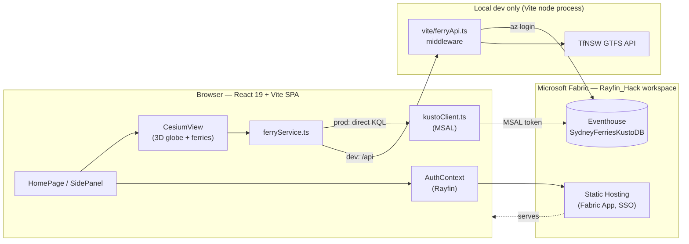
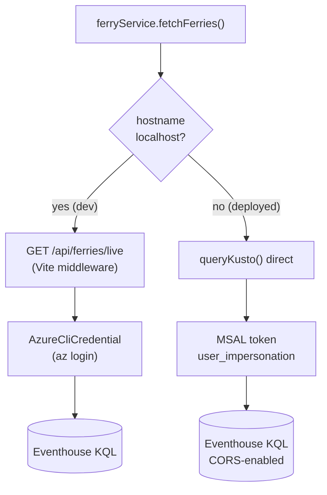
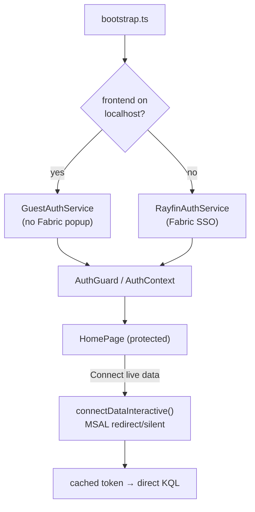
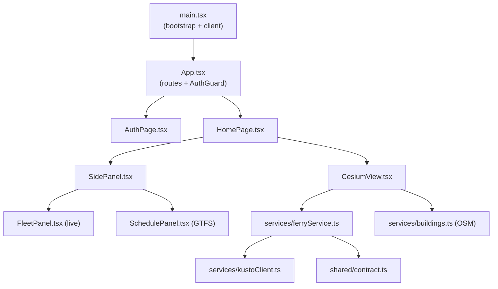

# Sydney Harbour — Live Ferries 3D

A photorealistic 3D map of Sydney Harbour that renders **live ferry positions**
from a Fabric Real-Time Intelligence **Eventhouse** (KQL). Built as a **Rayfin
Fabric App** (`Test_App`) on the `Rayfin_Hack` workspace: React 19 + Vite +
Cesium frontend, Fabric SSO for identity, and Fabric-hosted static content.

- **Live tracking** — polls the latest position per ferry every 5 s and animates
  each vessel gliding across the harbour. Heading is derived from movement
  (the feed has no bearing/speed field).
- **Photoreal 3D globe** — Cesium with Google Photorealistic 3D Tiles / Cesium
  OSM Buildings when a Cesium Ion token is present; falls back to keyless
  OpenStreetMap imagery + extruded OSM building footprints otherwise.
- **Fleet & timetable side panel** — a live fleet list (click to fly the camera
  to a ferry) plus today's TfNSW GTFS scheduled departures.
- **Wharf markers** placed from the Eventhouse `ReferenceLocation` table.

---

## Architecture

### System overview



### Data path — dev vs. production

The frontend always reads from a single configurable base, so only the data
source changes between environments:



- **Local dev** — a dev-only Vite middleware ([vite/ferryApi.ts](vite/ferryApi.ts))
  queries the Eventhouse using your local **`az login`** identity and exposes a
  clean same-origin JSON API. No CORS, no browser tokens.
- **Deployed** — there is no `/api` middleware, so the browser queries the
  Eventhouse **directly** ([src/services/kustoClient.ts](src/services/kustoClient.ts))
  using an MSAL access token for the signed-in Fabric user. The Eventhouse
  allows CORS from the app origin.

### Authentication



App identity uses the **Rayfin Fabric App** auth service. In local dev a
`GuestAuthService` avoids the Fabric popup; deployed builds use Fabric SSO via
`RayfinAuthService`. Live-data access to the Eventhouse is a **separate** MSAL
token acquired silently (or via a user-gesture "Connect live data" button when
interaction is required).

### Frontend module map



> **Alternate renderers (not wired into `HomePage`):** the repo also contains a
> Three.js voxel harbour ([src/three/](src/three/) + [FerryScene.tsx](src/components/FerryScene.tsx))
> and an Azure Maps 2.5D view ([MapView.tsx](src/components/MapView.tsx) +
> [SplatHero.tsx](src/components/SplatHero.tsx)). Cesium is the active view; the
> others are kept as reference implementations.

---

## Data source

Eventhouse `SydneyFerriesEventhouse` → KQL DB `SydneyFerriesKustoDB`
(cluster `https://trd-1u2v2sxv19k32hbdcc.z4.kusto.fabric.microsoft.com`).

| Table | Columns |
|---|---|
| `SydneyFerries` | `ferry_name`, `ferry_lat`, `ferry_long`, `ferry_destination`, `timestamp` |
| `ReferenceLocation` | `LocationId`, `LocationName`, `Latitude`, `Longitude`, `ProximityThreshold` |

"Latest position per active ferry" query (anchored to the newest sample so the
map stays populated even if the simulated feed pauses):

```kusto
SydneyFerries
| summarize arg_max(timestamp, *) by ferry_name
| where timestamp > todatetime('<latest>') - 15m
| project ferry_name, ferry_lat, ferry_long, ferry_destination, timestamp
```

---

## Run locally

```bash
# Deploy backend services (auth + data) to Fabric, then serve the frontend
npm run dev
```

Open [http://localhost:5173](http://localhost:5173) to view the app.

`npm run dev` deploys the backend services (auth + data) to Fabric, then serves
the frontend on `http://localhost:5173`. **Ferry data in dev** is served by the
Vite dev middleware ([vite/ferryApi.ts](vite/ferryApi.ts)), so run **`az login`**
as a user with read access to `SydneyFerriesKustoDB` first. It exposes:

- `GET /api/ferries/live` → `{ asOf, ferries: [...] }`
- `GET /api/reference-locations` → `{ locations: [...] }`
- `GET /api/ferries/schedule` → `{ date, asOf, count, departures: [...] }` — today's
  TfNSW GTFS scheduled departures. Query params: `?scope=all` (whole day; default
  is upcoming-only) and `?limit=N`.

---

## Configuration (environment variables)

Set in `Test_App/.env` (git-ignored) or the shell.

**Deployed frontend (build-time `VITE_*`):**

| Variable | Purpose |
|---|---|
| `VITE_KUSTO_CLUSTER` | Eventhouse cluster URI |
| `VITE_KUSTO_DATABASE` | KQL database (default `SydneyFerriesKustoDB`) |
| `VITE_ENTRA_CLIENT_ID` | Entra app (client) ID for interactive sign-in |
| `VITE_ENTRA_TENANT_ID` | Entra tenant ID |
| `VITE_KUSTO_SCOPE` | Optional token-scope override (default `<cluster>/user_impersonation`) |
| `VITE_FERRY_API` | Optional data API base (default `/api`) |
| `VITE_CESIUM_ION_TOKEN` | Cesium Ion token → world terrain, OSM Buildings, Photorealistic 3D Tiles |
| `VITE_FERRY_MODEL_URL` | Optional `.glb` ferry model (default `/models/ferry.glb`) |
| `VITE_RAYFIN_PUBLISHABLE_KEY`, `VITE_FABRIC_WORKSPACE_ID` | Rayfin / Fabric SSO |

**Local dev middleware (server-side):**

| Variable | Purpose |
|---|---|
| `KUSTO_CLUSTER_URI`, `KUSTO_DATABASE` | Override the Eventhouse target |
| `FERRY_ACTIVE_WINDOW` | Active-batch window (default `15m`) |
| `TFNSW_API_KEY` | TfNSW GTFS key for the schedule route |
| `TFNSW_FERRY_SCHEDULE_URL` | Override the GTFS endpoint |

> The GTFS timetable needs a secret server-side key, so in the **deployed** app
> the schedule degrades to empty rather than failing.

---

## Deploy to Fabric

```bash
# From Test_App/ — builds the frontend (build:fabric) and publishes as
# Fabric static content behind SSO
npx rayfin up staticapp deploy -y
```

Hosting URL: `https://broad-inlet-39886f4465-australiaeast.webapp.fabricapps.net`

---

## Scripts

| Command | Description |
|---------|-------------|
| `npm run dev` | Deploy backend services to Fabric and start the local dev server |
| `npm run build` | Production build (`tsc -b && vite build`) |
| `npm run build:fabric` | Build for Fabric deployment (entrypoint for `rayfin up staticapp deploy`) |
| `npm run build:ferry` | Rebuild the bundled ferry `.glb` model |
| `npm run lint` | Lint with ESLint |
| `npm run test` | Run unit tests with Vitest |
| `npm run rayfin:up` | Deploy app to Fabric (no local dev server) |

---

## Project structure

```text
├── rayfin/
│   └── rayfin.yml                 # Fabric service config (auth + data + static hosting)
├── vite/
│   ├── ferryApi.ts                # Dev-only KQL → JSON API middleware
│   └── gtfsSchedule.ts            # TfNSW GTFS timetable builder
├── scripts/
│   └── build-ferry-glb.mjs        # Bakes the bundled ferry model
├── public/models/                 # Static 3D assets (ferry.glb)
└── src/
    ├── main.tsx                   # Entry point + Rayfin client bootstrap
    ├── App.tsx                    # Routes and auth gate
    ├── hooks/AuthContext.tsx      # React context wrapping the auth helpers
    ├── pages/HomePage.tsx         # App shell: header + CesiumView + SidePanel
    ├── components/
    │   ├── AuthPage.tsx           # Sign-in UI
    │   ├── CesiumView.tsx         # Active 3D globe + ferry rendering
    │   ├── SidePanel.tsx          # Drawer hosting Fleet + Timetable tabs
    │   ├── FleetPanel.tsx         # Live fleet list
    │   ├── SchedulePanel.tsx      # GTFS timetable
    │   ├── MapView.tsx            # Azure Maps view (alternate, not wired)
    │   ├── FerryScene.tsx         # Three.js scene (alternate, not wired)
    │   └── SplatHero.tsx          # Shared HeroFerry types
    ├── services/
    │   ├── bootstrap.ts           # Picks Guest vs Rayfin auth service
    │   ├── ferryService.ts        # Dev /api vs. direct-Kusto data layer
    │   ├── kustoClient.ts         # Browser MSAL + KQL client (deployed)
    │   ├── buildings.ts           # OSM (Overpass) building footprints
    │   ├── IAuthService.ts        # Auth contract + AuthUser type
    │   ├── GuestAuthService.ts    # Local-dev auth impl
    │   ├── RayfinAuthService.ts   # Production Fabric SSO impl
    │   └── rayfinClient.ts        # Typed Rayfin client singleton
    ├── shared/
    │   ├── contract.ts            # Ferry / ReferenceLocation / schedule types
    │   ├── config.ts              # Poll interval, colours, tunables
    │   └── geo.ts                 # lat/lon → local ENU metres
    └── three/                     # Three.js SceneEngine / Harbour / FerryManager (alternate)
```

---

## Roadmap

- **Production data function (optional):** replace the deployed direct-Kusto
  path with a **Fabric User Data Function** (Python `fabric-user-data-functions`
  + `azure-kusto-data`) exposing the same queries, and point `VITE_FERRY_API`
  at it — no scene changes required.
- **Server-side GTFS:** proxy the TfNSW timetable through a function so the
  schedule works in the deployed app.
- **Voxel coastline (Phase 2):** bake Sydney Harbour coastline GeoJSON
  (OSM `natural=coastline` via Overpass) into a `harbour.glb` for the Three.js
  renderer.
