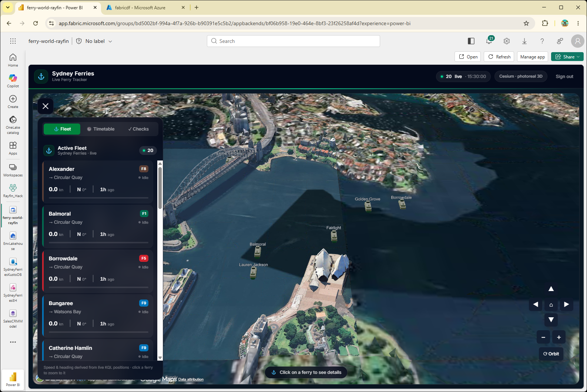
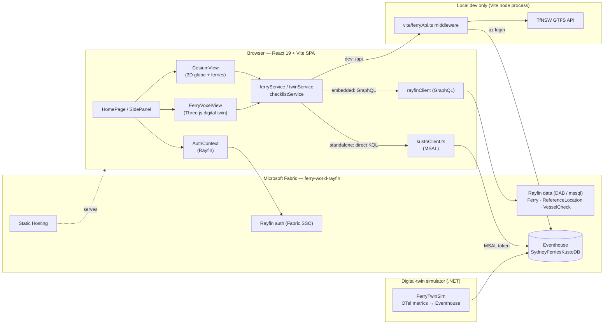
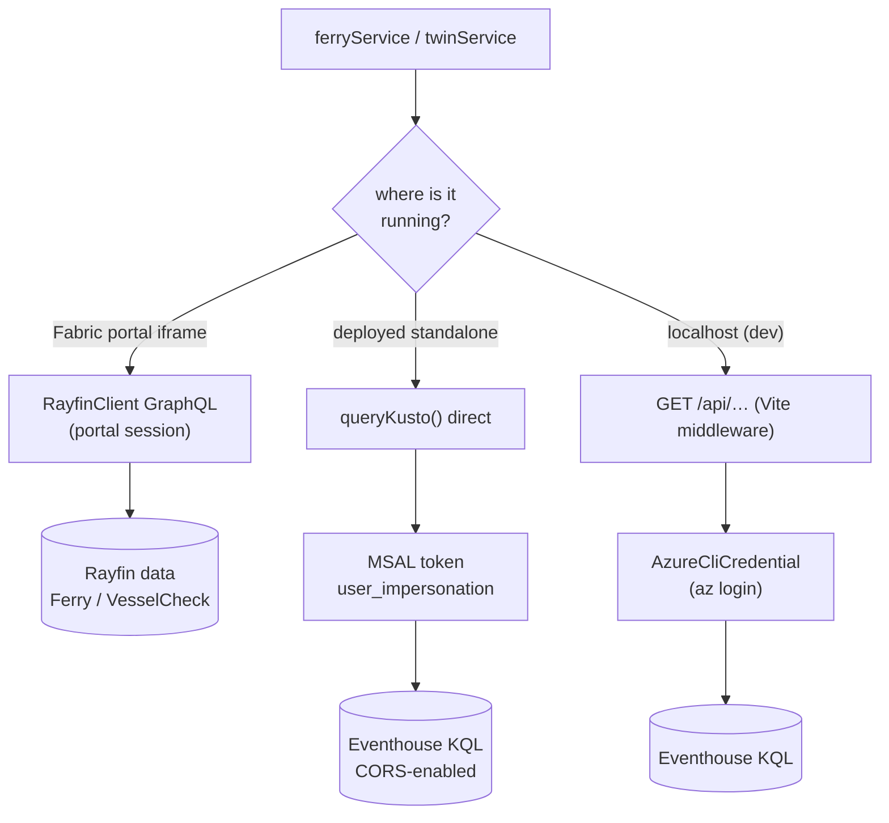
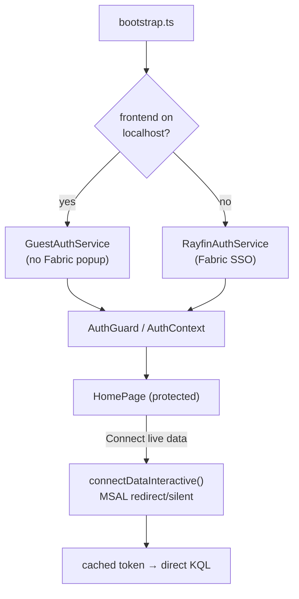
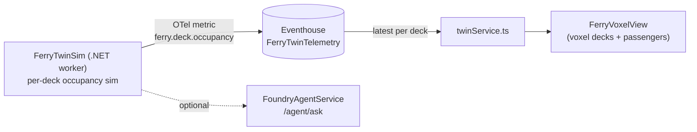
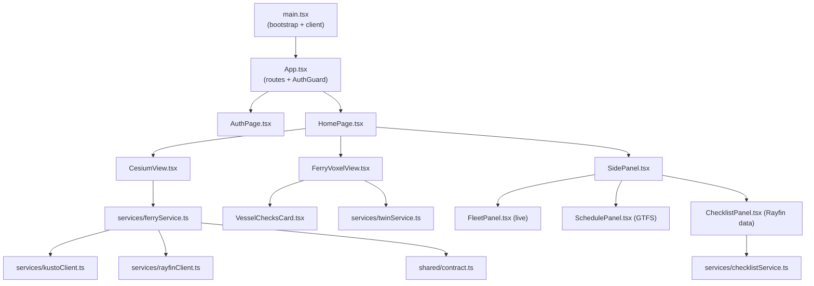
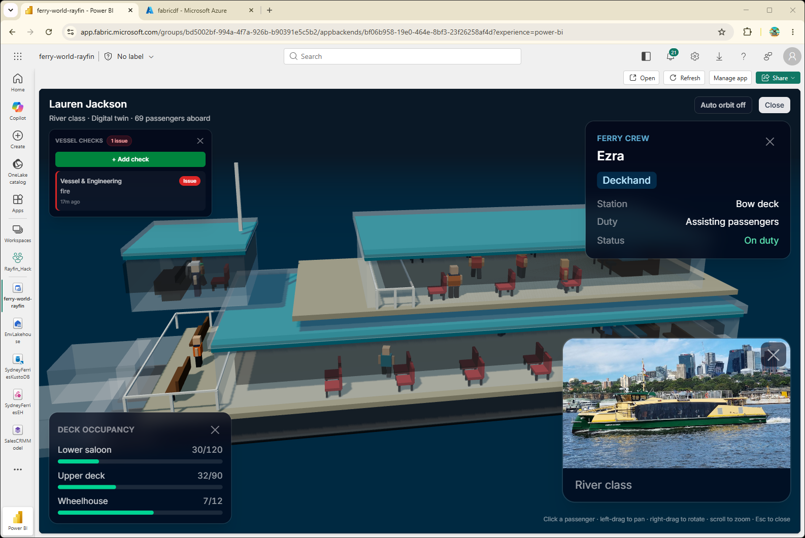

# Sydney Ferries — Live Ferries 3D



A photorealistic 3D map of Sydney Ferries that renders **live ferry positions**
from a Fabric Real-Time Intelligence **Eventhouse** (KQL), plus a **voxel digital
twin** of any vessel driven by OpenTelemetry occupancy metrics. Built as a
**Rayfin Fabric App** (`ferry-world-rayfin`): React 19 + Vite + Cesium frontend,
Fabric SSO for identity, a Rayfin **data** layer for current-state tables and
operator checklists, and Fabric-hosted static content.

- **Live tracking** — polls the latest position per ferry every few seconds and
  animates each vessel gliding across the harbour. Heading is derived from
  movement (the feed has no bearing/speed field).
- **Photoreal 3D globe** — Cesium with Google Photorealistic 3D Tiles / Cesium
  OSM Buildings when a Cesium Ion token is present; falls back to keyless
  OpenStreetMap imagery + extruded OSM building footprints otherwise.
- **Digital twin** — click a ferry to open a full-screen **voxel vessel** with
  decks, wheelhouse, and voxel passengers/crew, sized by live per-deck occupancy
  telemetry (`FerryTwinTelemetry`, OpenTelemetry metrics schema).
- **Vessel checks** — an operator checklist (pre-departure / in-service) stored
  through the Rayfin **data** service; flag issues per vessel.
- **Fleet, timetable & checks side panel** — a live fleet list (click to fly the
  camera to a ferry), today's TfNSW GTFS scheduled departures, and the checklist.
- **Wharf markers** placed from the `ReferenceLocation` table.

---

## Architecture

### System overview



### Data path — three modes

The frontend reads from a single service layer that picks its source at runtime,
so only the transport changes between environments:



- **Fabric portal (embedded)** — inside the Fabric app iframe the browser reads
  current-state tables and checklists through the Rayfin **data** service
  ([src/services/rayfinClient.ts](src/services/rayfinClient.ts)) using the
  session the portal already brokered. No MSAL token, no extra sign-in.
- **Deployed standalone** — a plain browser tab queries the Eventhouse
  **directly** ([src/services/kustoClient.ts](src/services/kustoClient.ts)) with
  an MSAL access token for the signed-in Fabric user. The Eventhouse allows CORS
  from the app origin.
- **Local dev** — a dev-only Vite middleware ([vite/ferryApi.ts](vite/ferryApi.ts))
  queries the Eventhouse using your local **`az login`** identity and exposes a
  same-origin JSON API. No CORS, no browser tokens.

### Authentication



App identity uses the **Rayfin Fabric App** auth service. In local dev a
`GuestAuthService` avoids the Fabric popup; deployed builds use Fabric SSO via
`RayfinAuthService`. When running standalone, live-data access to the Eventhouse
is a **separate** MSAL token acquired silently (or via a user-gesture "Connect
live data" button when interaction is required). Inside the Fabric portal the
"Connect live data" button never appears — the portal session is used directly.

### Digital twin



The .NET worker [dotnet/FerryTwinSim/](dotnet/FerryTwinSim/) simulates per-deck
passenger occupancy and ingests it into the Eventhouse table
`FerryTwinTelemetry` using the **OpenTelemetry metrics** data model (`MetricName`
= `ferry.deck.occupancy`, deck capacity carried in the metric attributes). The
deployed app reads the latest value per deck via KQL; local dev has no
Eventhouse, so a lightweight client-side simulation stands in so the voxel view
still shows passengers. An optional Microsoft Foundry agent endpoint
(`POST /agent/ask`) answers natural-language questions about the fleet.

### Frontend module map



> **Alternate renderers (not wired into `HomePage`):** the repo also contains a
> Three.js voxel harbour ([src/three/](src/three/) + [FerryScene.tsx](src/components/FerryScene.tsx))
> and an Azure Maps 2.5D view ([MapView.tsx](src/components/MapView.tsx) +
> [SplatHero.tsx](src/components/SplatHero.tsx)). Cesium is the active harbour
> view and `FerryVoxelView` the active twin; the others are reference code.

---

## Rayfin services

Configured in [rayfin/rayfin.yml](rayfin/rayfin.yml):

| Service | Enabled | Notes |
|---|---|---|
| `auth` | ✅ | Fabric SSO + password; redirect URIs for localhost and the hosted app |
| `data` | ✅ | Data API Builder, `mssql` dialect — current-state tables + checklist |
| `staticHosting` | ✅ | Serves `dist/` (`buildCommand: npm run build:fabric`) |
| `storage` / `functions` | ❌ | Not used |

### Data entities

Defined in [rayfin/data/](rayfin/data/) and registered in
[rayfin/data/schema.ts](rayfin/data/schema.ts):

| Entity | Auth | Purpose |
|---|---|---|
| `Ferry` | read | Current-state ferry positions (kept in sync with the Eventhouse) |
| `ReferenceLocation` | read | Wharves / landmarks used to dress the scene |
| `VesselCheck` | read/write | Operator checklist rows; write requires a signed-in user |

---

## Data source (Eventhouse)

Eventhouse `SydneyFerriesEventhouse` → KQL DB `SydneyFerriesKustoDB`
(cluster `https://trd-1u2v2sxv19k32hbdcc.z4.kusto.fabric.microsoft.com`).

| Table | Columns |
|---|---|
| `SydneyFerries` | `ferry_name`, `ferry_lat`, `ferry_long`, `ferry_destination`, `timestamp` |
| `ReferenceLocation` | `LocationId`, `LocationName`, `Latitude`, `Longitude`, `ProximityThreshold` |
| `FerryTwinTelemetry` | OpenTelemetry metrics — `MetricName`, `MetricValue`, `VesselId`, `DeckId`, `Attributes`, `Timestamp` |

"Latest position per active ferry" query (anchored to the newest sample so the
map stays populated even if the simulated feed pauses):

```kusto
SydneyFerries
| summarize arg_max(timestamp, *) by ferry_name
| where timestamp > todatetime('<latest>') - 15m
| project ferry_name, ferry_lat, ferry_long, ferry_destination, timestamp
```

Latest per-deck occupancy for a vessel's digital twin:

```kusto
FerryTwinTelemetry
| where MetricName == 'ferry.deck.occupancy' and VesselId == '<ferry_name>'
| summarize arg_max(Timestamp, MetricValue, Attributes) by DeckId
| project DeckId, MetricValue, Attributes
```

---

## Digital twin



Clicking a ferry opens `FerryVoxelView`: a Three.js voxel vessel whose decks are
populated from the live occupancy telemetry, with a deck-occupancy readout,
crew/passenger cards, and the vessel checklist inline.

---

## Run locally

```bash
# Deploy backend services (auth + data) to Fabric, then serve the frontend
npm run dev
```

Open [http://localhost:5173](http://localhost:5173) to view the app.

`npm run dev` first regenerates env vars (`rayfin env --framework vite`), deploys
the backend services excluding static hosting (`rayfin up --exclude-services
staticHosting`), then serves the frontend on `http://localhost:5173`. **Ferry
data in dev** is served by the Vite dev middleware ([vite/ferryApi.ts](vite/ferryApi.ts)),
so run **`az login`** as a user with read access to `SydneyFerriesKustoDB`
first. It exposes:

- `GET /api/ferries/live` → `{ asOf, ferries: [...] }`
- `GET /api/reference-locations` → `{ locations: [...] }`
- `GET /api/ferries/schedule` → `{ date, asOf, count, departures: [...] }` — today's
  TfNSW GTFS scheduled departures. Query params: `?scope=all` (whole day; default
  is upcoming-only) and `?limit=N`.

### Digital-twin simulator (optional)

```bash
cd dotnet/FerryTwinSim
dotnet run
```

Ingests per-deck occupancy telemetry into `FerryTwinTelemetry` and exposes
`GET /twin`, `GET /twin/{vesselId}`, and `POST /agent/ask`. Configure the
Eventhouse target and optional Foundry agent in `appsettings.json`.

---

## Configuration (environment variables)

`VITE_*` values are generated by `rayfin env --framework vite`; add overrides in
a git-ignored `.env` or the shell.

**Deployed frontend (build-time `VITE_*`):**

| Variable | Purpose |
|---|---|
| `VITE_KUSTO_CLUSTER` | Eventhouse cluster URI |
| `VITE_KUSTO_DATABASE` | KQL database (default `SydneyFerriesKustoDB`) |
| `VITE_ENTRA_CLIENT_ID` | Entra app (client) ID for interactive sign-in |
| `VITE_ENTRA_TENANT_ID` | Entra tenant ID |
| `VITE_KUSTO_SCOPE` | Optional token-scope override (default `<cluster>/user_impersonation`) |
| `VITE_FERRY_API` | Optional data API base (default `/api`) |
| `VITE_CESIUM_ION_TOKEN` | Cesium Ion token → world terrain, OSM Buildings, Photorealistic 3D Tiles |
| `VITE_FERRY_MODEL_URL` | Optional `.glb` ferry model (default `/models/ferry.glb`) |
| `VITE_RAYFIN_PUBLISHABLE_KEY`, `VITE_FABRIC_WORKSPACE_ID` | Rayfin / Fabric SSO |

**Local dev middleware (server-side):**

| Variable | Purpose |
|---|---|
| `KUSTO_CLUSTER_URI`, `KUSTO_DATABASE` | Override the Eventhouse target |
| `FERRY_ACTIVE_WINDOW` | Active-batch window (default `15m`) |
| `TFNSW_API_KEY` | TfNSW GTFS key for the schedule route |
| `TFNSW_FERRY_SCHEDULE_URL` | Override the GTFS endpoint |

> The GTFS timetable needs a secret server-side key, so in the **deployed** app
> (and the Fabric portal) the schedule degrades to empty rather than failing.

---

## Deploy to Fabric

```bash
# Builds the frontend (build:fabric) and publishes all Rayfin services
# (auth + data + static content behind SSO)
npm run rayfin:up
# or: npx rayfin up
```

---

## Scripts

| Command | Description |
|---------|-------------|
| `npm run dev` | Regenerate env, deploy backend services (excl. static hosting), start the local dev server |
| `npm run build` | Production build (`tsc -b && vite build`) |
| `npm run build:fabric` | Build for Fabric deployment (entrypoint for static hosting) |
| `npm run build:ferry` | Rebuild the bundled ferry `.glb` model |
| `npm run lint` | Lint with ESLint |
| `npm run test` | Run unit tests with Vitest |
| `npm run rayfin:up` | Deploy all Rayfin services to Fabric (no local dev server) |

---

## Project structure

```text
├── rayfin/
│   ├── rayfin.yml                 # Fabric service config (auth + data + static hosting)
│   └── data/                      # Rayfin data entities (DAB / mssql)
│       ├── Ferry.ts               # Current-state ferry positions (read)
│       ├── ReferenceLocation.ts   # Wharves / landmarks (read)
│       ├── VesselCheck.ts         # Operator checklist rows (read/write)
│       └── schema.ts              # Entity registry
├── dotnet/FerryTwinSim/           # .NET twin simulator → OTel occupancy telemetry
├── fabric/                        # Fabric artefacts (KQL, Eventhouse deploy, PBI report)
├── bicep/                         # Infra for the simulator web app + monitoring
├── vite/
│   ├── ferryApi.ts                # Dev-only KQL → JSON API middleware
│   └── gtfsSchedule.ts            # TfNSW GTFS timetable builder
├── scripts/build-ferry-glb.mjs    # Bakes the bundled ferry model
├── public/models/                 # Static 3D assets (ferry.glb)
└── src/
    ├── main.tsx                   # Entry point + Rayfin client bootstrap
    ├── App.tsx                    # Routes and auth gate
    ├── hooks/AuthContext.tsx      # React context wrapping the auth helpers
    ├── pages/HomePage.tsx         # App shell: header + CesiumView + SidePanel + twin
    ├── components/
    │   ├── AuthPage.tsx           # Sign-in UI
    │   ├── CesiumView.tsx         # Active 3D globe + ferry rendering
    │   ├── FerryVoxelView.tsx     # Voxel digital-twin popup
    │   ├── VesselChecksCard.tsx   # Inline checklist inside the twin view
    │   ├── SidePanel.tsx          # Drawer hosting Fleet / Timetable / Checks tabs
    │   ├── FleetPanel.tsx         # Live fleet list
    │   ├── SchedulePanel.tsx      # GTFS timetable
    │   ├── ChecklistPanel.tsx     # Vessel checks (Rayfin data)
    │   ├── MapView.tsx            # Azure Maps view (alternate, not wired)
    │   ├── FerryScene.tsx         # Three.js scene (alternate, not wired)
    │   └── SplatHero.tsx          # Shared HeroFerry types
    ├── services/
    │   ├── bootstrap.ts           # Picks Guest vs Rayfin auth service
    │   ├── ferryService.ts        # Embedded GraphQL / dev /api / direct-Kusto data layer
    │   ├── twinService.ts         # Digital-twin occupancy (Eventhouse or local sim)
    │   ├── checklistService.ts    # Vessel checks (Rayfin data or localStorage)
    │   ├── kustoClient.ts         # Browser MSAL + KQL client (deployed standalone)
    │   ├── rayfinClient.ts        # Typed Rayfin client singleton (GraphQL)
    │   ├── buildings.ts           # OSM (Overpass) building footprints
    │   ├── IAuthService.ts        # Auth contract + AuthUser type
    │   ├── GuestAuthService.ts    # Local-dev auth impl
    │   └── RayfinAuthService.ts   # Production Fabric SSO impl
    ├── shared/
    │   ├── contract.ts            # Ferry / ReferenceLocation / schedule / twin / check types
    │   ├── checks.ts              # Checklist categories + helpers
    │   ├── config.ts              # Poll interval, colours, tunables
    │   └── geo.ts                 # lat/lon → local ENU metres
    └── three/                     # Three.js SceneEngine / Harbour / VoxelFerry / FerryManager
```

---

## Roadmap

- **Production data function (optional):** replace the deployed direct-Kusto
  path with a **Fabric User Data Function** (Python `fabric-user-data-functions`
  + `azure-kusto-data`) exposing the same queries, and point `VITE_FERRY_API`
  at it — no scene changes required.
- **Server-side GTFS:** proxy the TfNSW timetable through a function so the
  schedule works in the deployed app and the Fabric portal.
- **Voxel coastline (Phase 2):** bake Sydney Ferries coastline GeoJSON
  (OSM `natural=coastline` via Overpass) into a `harbour.glb` for the Three.js
  renderer.
